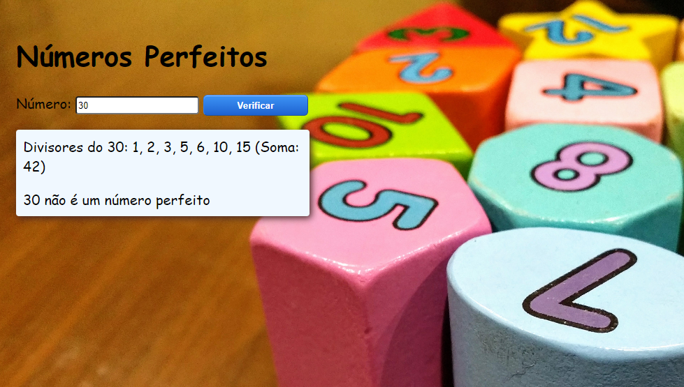

# Olá, bem vindo ao meu GITHUB

## Programa Números Perfeitos

- Exercício proposto pelo livro "Lógica de Programação e Algoritmos com JavaScript" do autor Edécio Fernando Lepsen e editora novatec. Saiba mais sobre o livro [aqui].(<https://leitura.com.br/logica-de-programacao-e-algoritmos-com-javascript-L006-9788575226568#:~:text=L%C3%B3gica%20de%20programa%C3%A7%C3%A3o%20e%20algoritmos%20com%20JavaScript&text=Os%20conte%C3%BAdos%20abordados%20em%20L%C3%B3gica,imp%C3%B5em%20algumas%20dificuldades%20aos%20iniciantes.>)
- Peguei a ideia do exercício e estilizei a página ao meu gosto.
- O programa ler um número e verifica se ele é ou não perfeito. Um número perfeito é 
aquele que é igual à soma dos seus divisores inteiros(exceto o próprio número).

 

  

